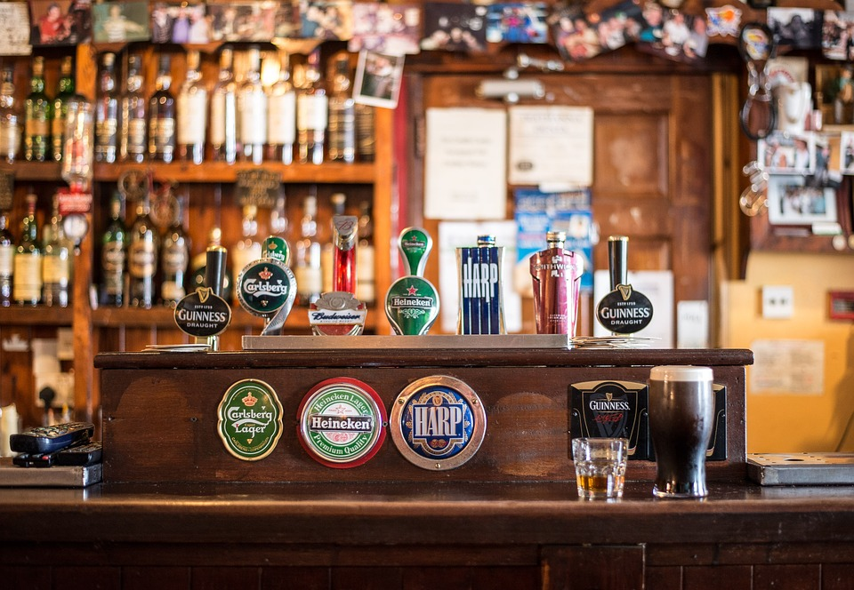

# Beer Recommendation App

**Submitted By:** Sara Kim | Dong Yi Kim | Saif Gorges | Saloni Gupta  
_Date_: March, 25th, 2021\
EDA & Machine Learning Project - **Beer Recommendation Web Application**  

Find the completed Toronto New Restaurant Analysis dashboard here: [Beer Recommendation App](https://beer-recommendation-app.herokuapp.com/)

## Table of Contents
  * [Overview](#overview)
  * [Methods of Recommendation](#machine-learning)
    * [Similarity-Based CF](#similarity-based)
    * [User-Based CF](#ratings-based)
  * [Technologies](#technologies)

## Overview
This project aims to deliver personalized beer recommendations to beer lovers across the country. Our final product consists of web scraped data, item-based collaborative filtering models using nearest neighbor collaborative filtering and latent factor collaborative filtering, all packed into an interactive Flask web-application. Our purpose is twofold: to create a recommender system of something fun for others to use and in the process learn how to build a complex recommender system.

  
## Methods of Recommendation

#### Based on Similarity
This recommendation will be based on similarity between beers. Select one of the beers you like and a factor you think is the most important between flavor, aroma and texture for the beer. 

#### Based on Ratings
This recommendation will be based on your ratings for three beers that you choose to rate. Select three beers you know and rate them - ratings can be between 1 to 5. 

## Deployment
This app is deployed publicly on Heroku, click [here](https://beer-recommendation-app.herokuapp.com/) to check it out!
 
 
## <a name="technologies">Technologies</a>
This project was created with:
* JavaScript
* HTML/CSS
* D3.js
* Flask
* Python 3.8
* Pandas
* Jupyter Notebook
* Selenium
* Scikit-learn

